# 🔄 Dev.to Weekly Automation Workflow

This diagram illustrates the "Zero-Touch" content pipeline for MandaAct.

```mermaid
graph TD
    %% Schedules
    Sunday((📅 Sunday 09:00)) -->|Trigger| TopicCommittee
    Monday((📅 Monday 09:00)) -->|Trigger| DraftWriter

    %% Phase 1: Topic Selection
    subgraph "Phase 1: Topic Committee"
        TopicCommittee[Script: select_topic.js]
        
        Archive[📄 ARCHIVE.md] --> TopicCommittee
        Trends[🌍 Market Trends] -.-> TopicCommittee
        
        TopicCommittee -->|GPT-4o API| AI_Topic[🤖 Topic Generation]
        AI_Topic -->|Enforce| MandaActAngle{MandaAct Angle?}
        
        MandaActAngle -- Yes --> QueueUpd[Update TOPIC_QUEUE.md]
        MandaActAngle -- No --> AI_Topic
    end

    %% Connection
    QueueUpd -->|Commit & Push| Repo[📂 GitHub Repo]
    Repo -->|Read Top Item| DraftWriter

    %% Phase 2: Draft Generation
    subgraph "Phase 2: Draft Writer"
        DraftWriter[Script: generate_draft.js]
        
        Context[📄 MandaAct_Context.md] --> DraftWriter
        Queue[📄 TOPIC_QUEUE.md] --> DraftWriter
        
        DraftWriter -->|GPT-4o API| AI_Draft[🤖 Draft Generation]
        
        %% Phase 3: Fact Checker
        subgraph "Phase 3: Fact Checker (Self-Correction)"
            AI_Draft --> FactCheck[🕵️‍♂️ Fact-Checker Agent]
            Context -->|Ground Truth| FactCheck
            
            FactCheck -->|Verify Features| Hallucination{Hallucination?}
            Hallucination -- Yes: 'OCR', 'Deep Work' --> Fix[✂️ Rewrite Section] --> FinalDraft
            Hallucination -- No --> FinalDraft[📝 Final Markdown]
        end
    end

    %% Phase 4: Delivery
    FinalDraft -->|Save| DraftFile[📄 drafts/YYYY-MM-DD-slug.md]
    DraftFile -->|Create Branch| Branch[🌿 draft/weekly-date]
    Branch -->|Push & Open PR| PR[🚀 Pull Request]
    
    %% User Action
    PR -->|Mobile Notification| UserPhone[� User Review]
    UserPhone -->|Merge| Deploy[📢 Dev.to Publish]
```

## Workflow Steps

1.  **Sunday (Topic Committee)**:
    *   The `select_topic.js` script wakes up.
    *   It reads past articles (`ARCHIVE.md`) to avoid duplicates.
    *   It consults the AI to pick a trending topic *specifically* connecting to MandaAct's 9x9 philosophy.
    *   Result: A new topic is added to the "On Deck" list in `TOPIC_QUEUE.md`.

2.  **Monday (Draft Writer)**:
    *   The `generate_draft.js` script wakes up.
    *   It takes the top topic from the Queue.
    *   It reads the `MandaAct_Context.md` to understand what the product *actually* does.
    *   **Generation**: It writes a full article draft.
    *   **Fact-Checking**: The "Fact-Checker Agent" immediately reviews the draft. If it sees "OCR" (fake) or "Deep Work Mode" (fake), it replaces them with real features like "Goal Diagnosis" or "Today's View".

3.  **Human Review**:
    *   You open the new Draft file (or PR).
    *   If it looks good, you merge/publish it.
