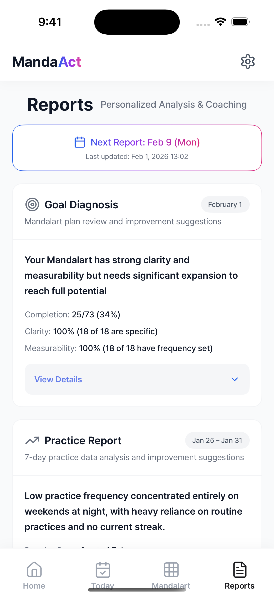
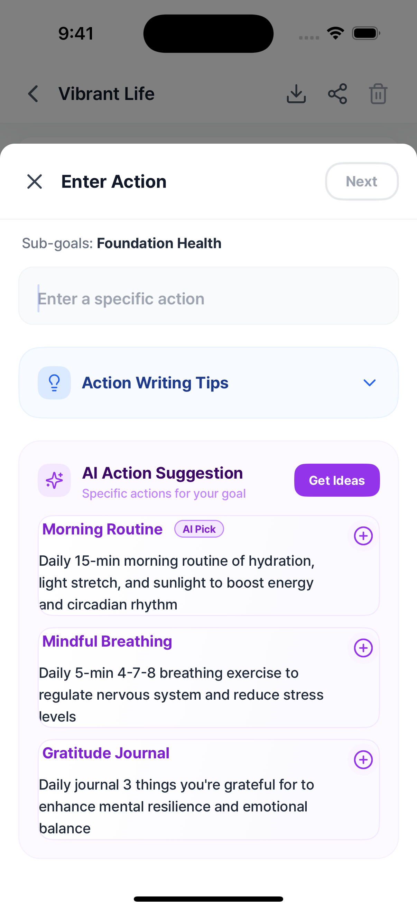

## The Problem: Planning is Easy, Doing is Hard

We've all been there with New Year's resolutions. We write down "Get Fit", "Learn Rust", or "Start a Side Project". But a month later, the motivation fades. 

Why? **Because goals feel distant and abstract.**

I built **MandaAct** to solve this using the **Mandalart (9x9 Grid)** technique. It breaks big goals down into bite-sized actions. But even with a great plan, *execution* needs a smart assistant.

That's why I'm excited to share the **MandaAct 1.1.0 Update**: The "AI & Clarity" Update.

---

## 🚀 What's New in 1.1.0?

### 1. Goal Diagnosis: Are You Being Specific?
A plan is useless if it's vague. "Exercise more" is a wish, not a plan. "Do 30 pushups daily" is a plan.

In 1.1.0, I introduced **Goal Diagnosis**. The app analyzes your grid and gives you a **Clarity Score**.

*(Caption: The new Report screen showing 34% completion and 100% clarity score)*

It checks:
*   **Specificity**: Are your actions concrete?
*   **Measurability**: Did you set a frequency (e.g., "Daily", "Weekly")?

### 2. AI Suggestions: When You're Stuck
Filing a 9x9 grid means coming up with 64 actionable tasks. That's mentally exhausting. Sometimes you just stare at a blank cell.

In 1.1.0, **AI Suggestions** come to the rescue.

*(Caption: AI suggesting concrete actions like 'Morning Routine' and 'Mindful Breathing' for a health goal)*

*   **Idea Generation**: Stuck on "Financial Stability"? The AI suggests actions you might not have thought of (e.g., "Review subscriptions monthly", "Set up auto-transfer").
*   **Actionable & Specific**: It doesn't just give generic advice; it gives you checkable tasks.

Now, planning your goals feels less like homework and more like assembling a strategy with a smart assistant.

---

## 🎯 Try It Out

If you're struggling to stick to your goals, give MandaAct a try. The 1.1.0 update is live on the App Store.

👉 [Download on App Store](https://apps.apple.com/mx/app/mandaact-turn-goal-into-action/id6756198473)
👉 [Web Landing Page](https://mandaact.vercel.app)

Let me know what you think! I'm actively building based on feedback.

#productivity #indiehackers #buildinpublic
